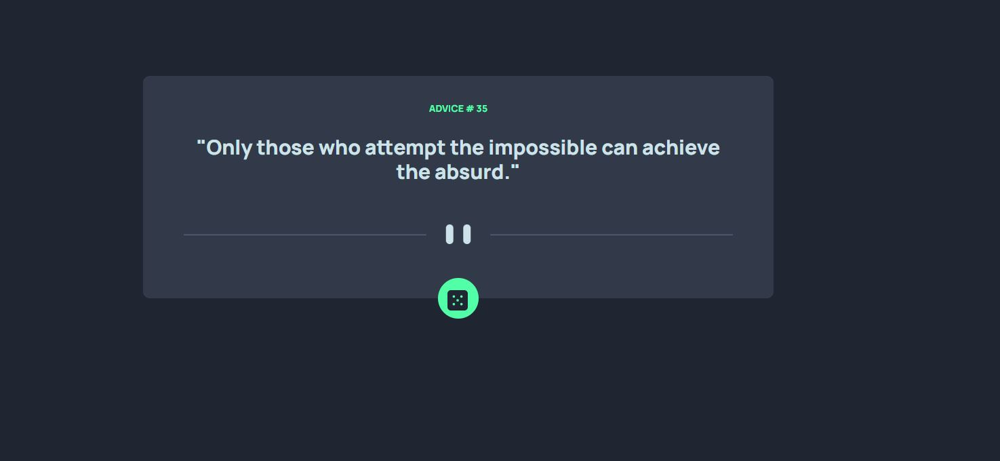

## Table of contents
- [Overview](#overview)
  - [The challenge](#the-challenge)
  - [Screenshot](#screenshot)
  - [Link](#link)
- [My process](#my-process)
  - [Built with](#built-with)
  - [What I learned](#what-i-learned)
  - [Useful resources](#useful-resources)
- [Author](#author)
- [Acknowledgments](#acknowledgments)

**Note: Delete this note and update the table of contents based on what sections you keep.**

## Overview

### The challenge

Users should be able to:

- View the optimal layout for the app depending on their device's screen size
- See hover states for all interactive elements on the page
- Generate a new piece of advice by clicking the dice icon

### Screenshot

### Links

- Solution URL: (https://njabz-1.github.io/Advice-Generator/)

## My process

### Built with

- Semantic HTML5 markup
- CSS custom properties
- Flexbox
- Javascript
- Mobile-first workflow

### What I learned

I learned how to use the addEventListener DOM element to generate advice. I also learned how to use the fetch API to get data from an API. 
### Useful resources

W3 schools - (https://www.w3schools.com/) - This helped me with generating advice using the addEventListener DOM element. 

## Author

Njabz :)

## Acknowledgments

Oston Code Cypher - (https://www.youtube.com/ostoncodecypher)
